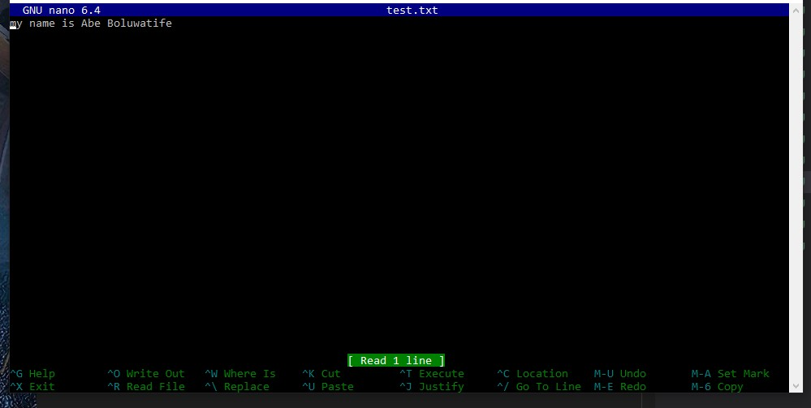
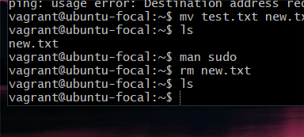

*10 LINUX COMMANDS*
*NB: screenshots with more than one command could not crop beyond, reference is only made to the command noted in the explanation*

*1. touch: The touch command is used to create a file as shown below*

*2. echo: The echo command helps us to move some data, usually text into a file*

*3. nano: The nano command can be used as an editor to open and also modify a file*

*This is the output of echo and nano commands. The text was added with the echo command and the file was opened with the nano command*

*4. mv: the mv command can be used rename a file*

*5. uname: the uname command is used to show the information about the system your Linux distro is running "uname-a" prints most of the information about the system*
*6. hostname: The hostname command can be used to know your name in your host or network*

*7. man: The man command shows the manual pages of a command, to know more about a command and how to use it*

*output of the man command using sudo as the command to know more about*

*8. df: The df command is used to see the available disk space in each of the partitions of your system in KBs*

*9. df -m: The df -m command is used to see the available disk space in each of the partitions of your system in Megabytes*

*10. rm: The rm command is used to delete all files and directories*

