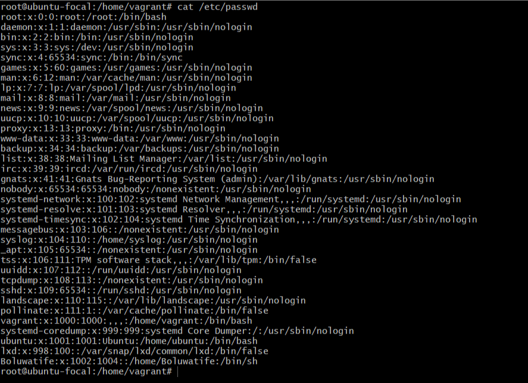
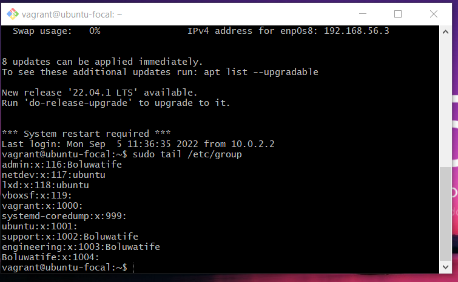
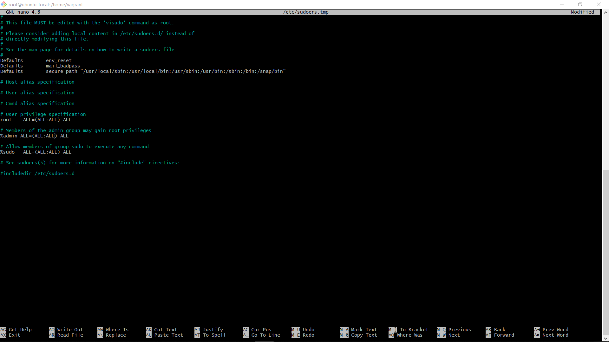
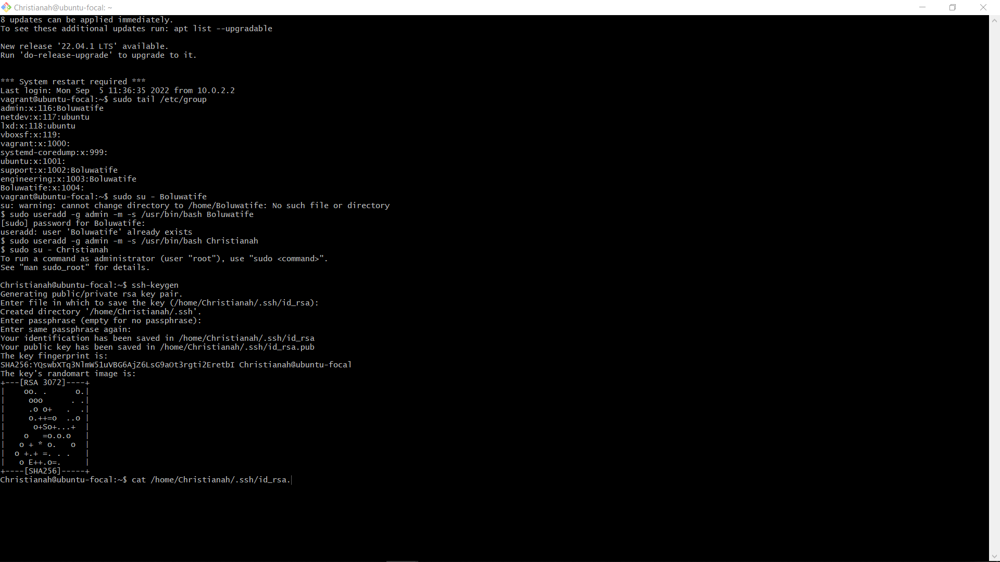

THE FOLLOWING IMAGES CONTAINS CONTENT OF /etc/passwd, /etc/group, /etc/sudoers and ssh key for one of the users

*contents of /etc/passwd*    

*contents of /etc/group*    

*contents of /etc/sudoers*    

*ssh key created for user*    

