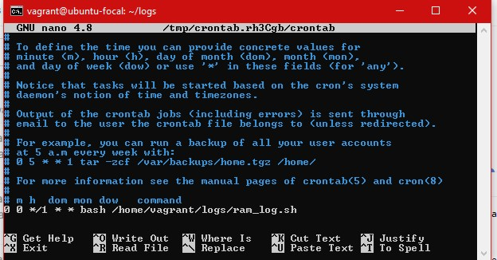

*The following two images are the screenshot of bash script*    
<<<<<<< HEAD
    

        
=======
    

        
>>>>>>> 6b2224082e9a4fb6b7f0f5c79e9931e9766d92f1

*Screenshot of cronjob*    
        

*Screenshot of email with daily RAM usage*    
<<<<<<< HEAD
    
=======
    
>>>>>>> 6b2224082e9a4fb6b7f0f5c79e9931e9766d92f1
